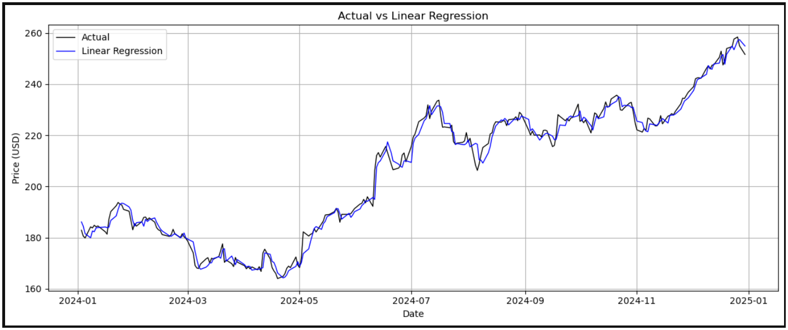
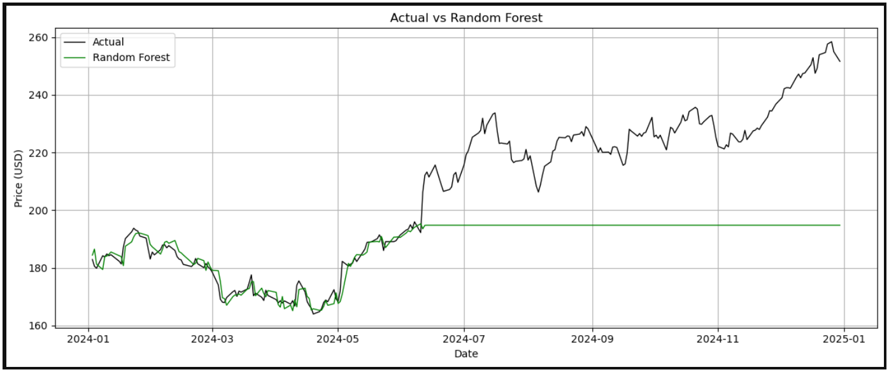
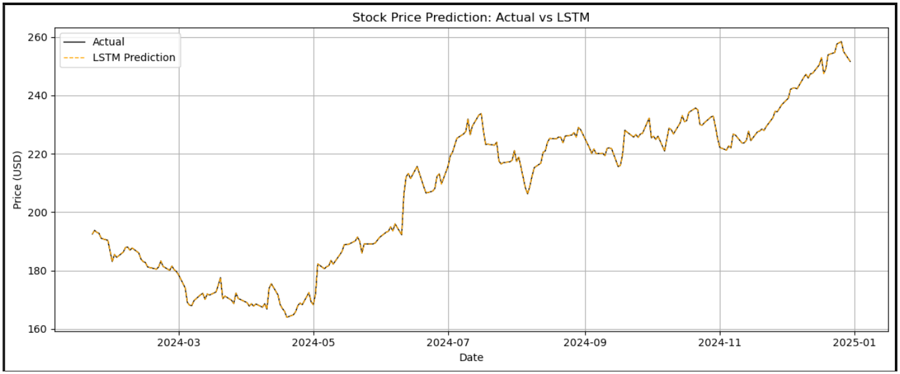
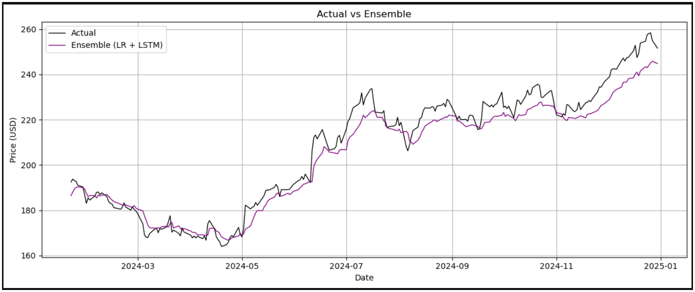
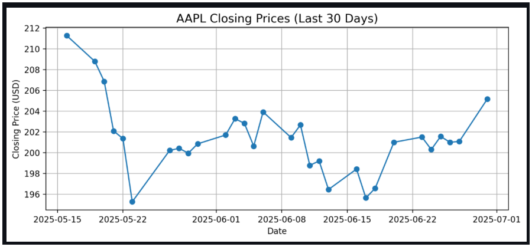
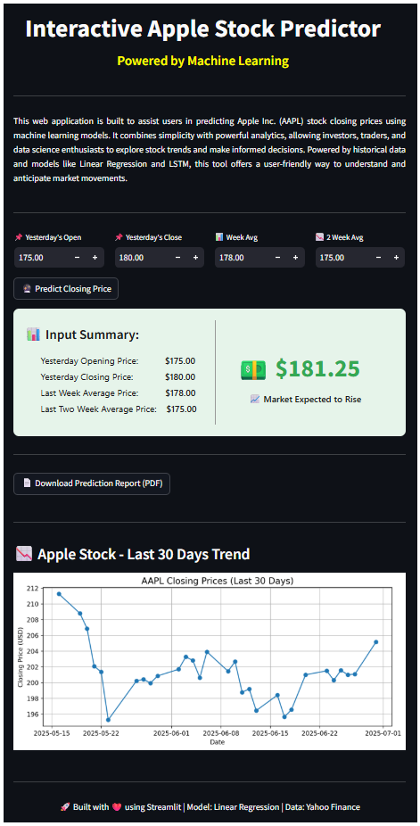

# Apple Stock Predictor

📈 **Interactive Apple Stock Predictor** — Predict Apple Inc. (AAPL) stock closing prices using Machine Learning and Deep Learning models based on historical data.

---

## Project Overview

This project forecasts Apple Inc. (AAPL) stock closing prices using historical stock data from 2020 to 2024. It implements multiple models including:

- Linear Regression  
- Random Forest Regressor  
- LSTM (Long Short-Term Memory neural network)  
- Ensemble model combining Linear Regression and LSTM  

The goal is to compare the effectiveness of classical machine learning methods and deep learning approaches for time series stock price prediction.

---

## Features

- Download historical stock data using Yahoo Finance API (`yfinance`)  
- Feature engineering with lagged closing prices and moving averages  
- Train/test split preserving time series order  
- Models implemented:  
  - Linear Regression  
  - Random Forest Regressor  
  - LSTM with PyTorch  
  - Ensemble of Linear Regression and LSTM  
- Performance evaluation with RMSE, MAE, and R² metrics  
- Visualization of actual vs predicted prices  
- Interactive web app built with Streamlit  
- PDF report generation with prediction summary and stock trend plots  

---

## Installation

1. Clone the repository:

   ```bash
   git clone https://github.com/Poorna-Kaushalya/Stock-Price-Prediction-using-Time-Series-Analysis.git
   ```

2. Install dependencies:

   ```bash
   pip install -r requirements.txt
   ```

---

## Usage

### Train the Models

Run the training script to download data, train models, evaluate, and save the Linear Regression model:

```bash
python daily_update.py
```

### Run the Streamlit App

Launch the interactive web app for prediction and PDF report generation:

```bash
streamlit run app.py
```

---

## Model Details

### Linear Regression

* Uses lagged opening price, lagged closing price, 7-day and 14-day moving averages as features
* Fast, interpretable, and best performance among tested models on this dataset

### Random Forest Regressor

* Ensemble tree-based model
* Did not perform well on this time series dataset likely due to temporal dependencies

### LSTM Neural Network

* Deep learning model for sequential data
* Uses scaled closing prices and sequences of 60 days for training

### Ensemble Model

* Averages predictions from Linear Regression and LSTM models
* Improves accuracy by combining strengths of both

---

## Evaluation Metrics
<div align="center">
  
| Model                | RMSE  | MAE   | R²   | Interpretation                                    |
| -------------------- | ----- | ----- | ---- | ------------------------------------------------- |
| Linear Regression    | 2.70  | 2.06  | 0.99 | Best performance among individual models          |
| Random Forest        | 25.51 | 18.87 | 0.00 | Poor performance; likely overfitting              |
| LSTM                 | 10.41 | 8.46  | 0.84 | Good performance leveraging sequential patterns   |
| Ensemble (LR + LSTM) | 5.85  | 4.73  | 0.95 | Combines strengths to improve prediction accuracy |

</div>

---

## Visualization

* Plots comparing actual vs predicted closing prices for each model

<div align="center">
  
<table>
  <tr>
    <td align="center">
      <strong>Linear Regression</strong><br>
      
    </td>
    <td align="center">
      <strong>Random Forest</strong><br>
      
    </td>
  </tr>
  <tr>
    <td align="center">
      <strong>LSTM</strong><br>
      
    </td>
    <td align="center">
      <strong>Ensemble (LR + LSTM)</strong><br>
      
    </td>
  </tr>
</table>

</div>

* Interactive 30-day closing price trend graph in the Streamlit app

<div align="center">
  
</div>

* User Interface

<div align="center">
  
</div>

---

## Built With

* [Python 3.8+](https://www.python.org/)
* [yfinance](https://pypi.org/project/yfinance/)
* [pandas](https://pandas.pydata.org/)
* [numpy](https://numpy.org/)
* [matplotlib](https://matplotlib.org/)
* [scikit-learn](https://scikit-learn.org/)
* [PyTorch](https://pytorch.org/)
* [Streamlit](https://streamlit.io/)
* [fpdf2](https://pypi.org/project/fpdf2/)

---

## License

This project is licensed under the MIT License. See the [LICENSE](LICENSE) file for details.

---

## Acknowledgements

* Yahoo Finance API (`yfinance`) for providing free financial data
* Open-source libraries such as Scikit-learn, PyTorch, and Streamlit
* Inspiration and examples from various machine learning and financial forecasting resources
---
#### Built with  by [Poorna Kaushalya](https://github.com/Poorna-Kaushalya)
If you want, I can also help you create the requirements.txt, daily_update.py, or app.py files. Just ask!
